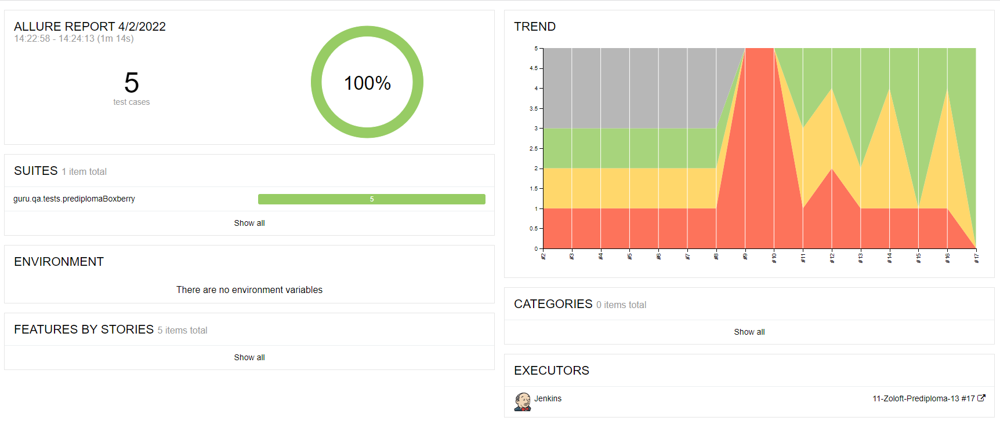
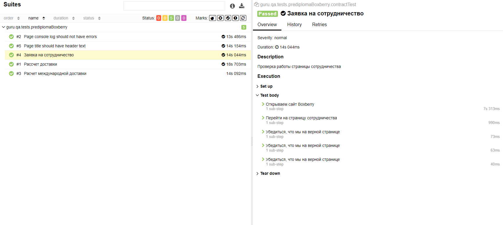
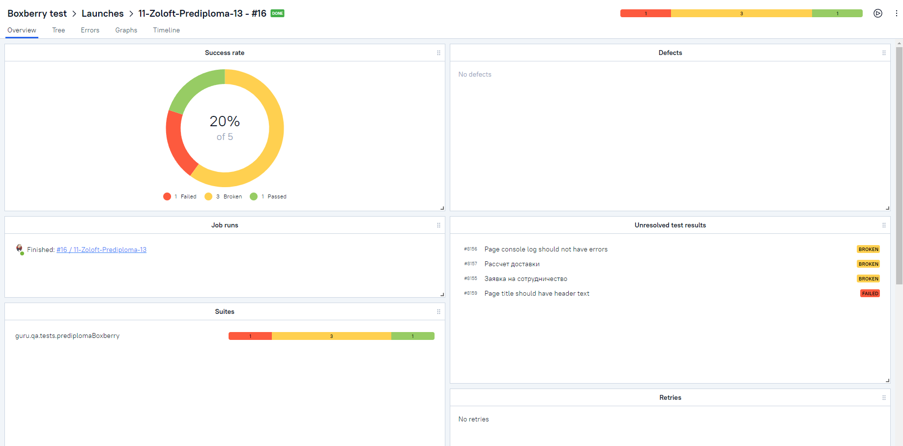
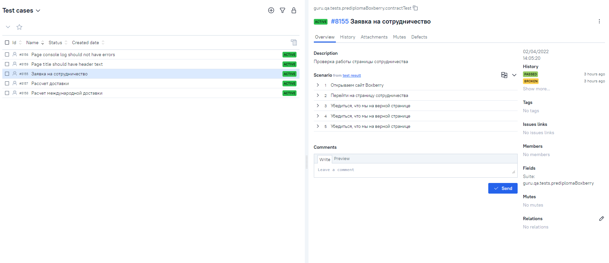
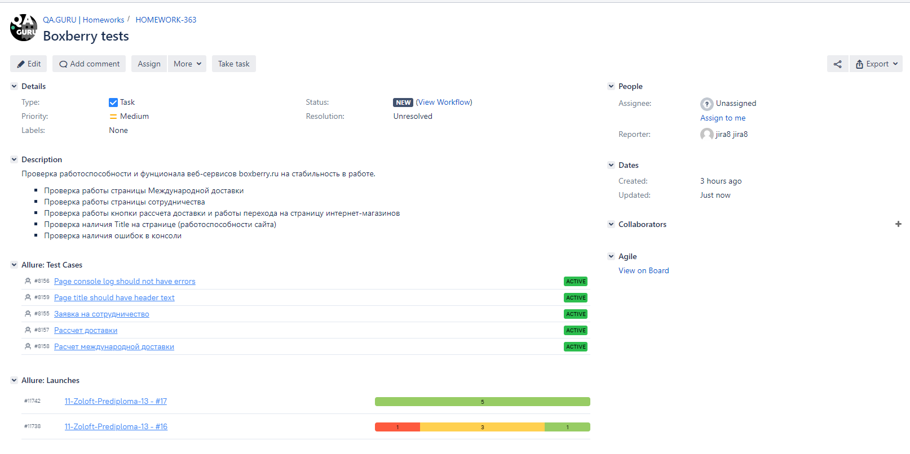
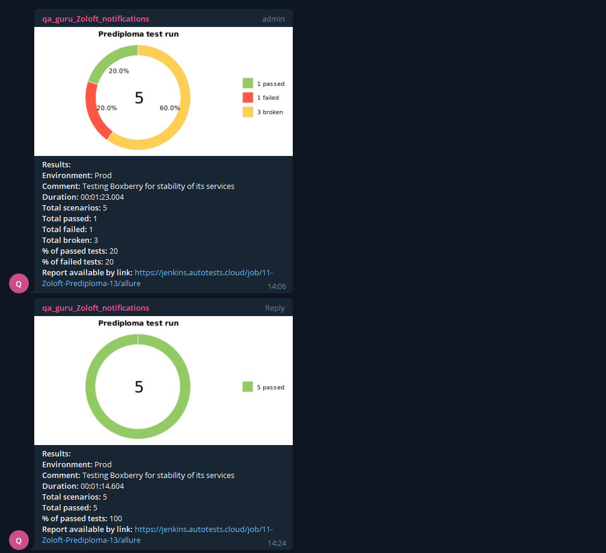

# Проект по автоматизации тестирования boxberry.ru
<a href="https://boxberry.ru/"></a>

## :point_up: Структура:

- <a href="#point_up_2-технологии-и-инструменты">Стек</a>
- <a href="#point_up_2-проведенные автотесты">Проведенные автотесты</a>
- <a href="#point_up_2-сборка-в-Jenkins">Сборка в Jenkins</a>
- <a href="#point_up_2-запуск-из-терминала">Запуск из терминала</a>
- <a href="#point_up_2-allure-отчет">Allure отчет</a>
- <a href="#point_up_2-интеграция-с-allure-testops">Интеграция с Allure TestOps</a>
- <a href="#point_up_2-интеграция-с-jira">Интеграция с Jira</a>
- <a href="#point_up_2-отчет-в-telegram">Отчет в Telegram</a>
- <a href="#point_up_2-видео-примеры-прохождения-тестов">Видео примеры прохождения тестов</a>

## :point_up_2: Стек
<p align="center">


</p>

## :point_up_2: Проведенные автотесты
- Проверка работы страницы Международной доставки (тесты с PageObjects)
- Проверка работы страницы сотрудничества (тесты с PageObjects)
- Проверка работы кнопки рассчета доставки и работы перехода на страницу интернет-магазинов (тесты с PageObjects)
- Проверка наличия Title на странице (работоспособности сайта)
- Проверка наличия ошибок в консоли

## :point_up_2: Сборка в Jenkins
### <a target="_blank" href="https://jenkins.autotests.cloud/job/11-Zoloft-Prediploma-13/">Сборка в Jenkins</a>
<p align="center">

</p>

### Параметры сборки в Jenkins:
Сборка в Jenkins

- repository (возможность сборки со своим репозиторием)
- browser (браузер, по умолчанию chrome)
- version (версия браузера, по умолчанию 91.0)
- size (размер окна браузера, по умолчанию 1920x1080)
- browsermobile (возможность запуска в мобильном браузере)
- remoteUrl (адрес удаленного сервера selenoid)
- threads (количество потоков, по умолчанию 5)
- allure notification version (выбор версии Allure Notification, по умолчанию 2.2.3)

## :point_up_2: Запуск из терминала
Локальный запуск:
```
gradle clean test
```

Удаленный запуск:
```
clean
test
-Duser=${USER}
-Dpassword=${PASSWORD}
-Dbrowser=${BROWSER}
-DremoteDriverUrl=https://${USERNAME}:${PASSWORD}@${REMOTE_DRIVER_URL}/wd/hub/
-DbrowserVersion=${BROWSER_VERSION}
-DbrowserSize=${BROWSER_SIZE}
-DbrowserMobileView="${BROWSER_MOBILE}"
-Dthreads=${THREADS}
```

## :point_up_2: Allure отчет
- ### Главный экран отчета
<p align="center">

</p>

- ### Страница с проведенными тестами
<p align="center">

</p>

## :point_up_2: Интеграция с Allure TestOps
- ### Экран с результатами запуска тестов
<p align="center">

</p>

- ### Страница с тестами в TestOps
<p align="center">

</p>

## :point_up_2: Интеграция с Jira
- ### Страница с задачей в Jira
<p align="center">

</p>

## :point_up_2: Отчет в Telegram
<p align="center">

</p>

## :point_up_2: Видео примеры прохождения тестов
> К каждому тесту в отчете прилагается видео. Одно из таких видео представлено ниже.
<p align="center">
  
</p>
